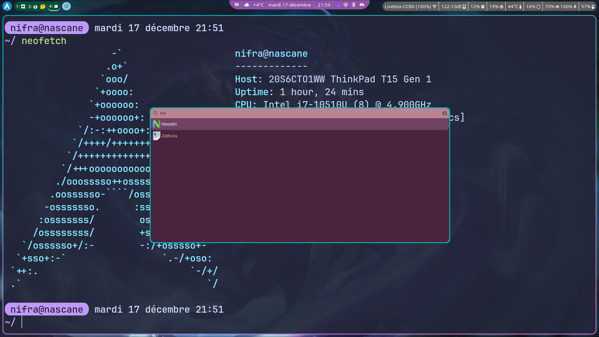

# My dotfiles - Managed with [chezmoi](https://www.chezmoi.io/)

<!-- markdownlint-disable MD013 MD026 MD033 -->

<a href="https://dotfyle.com/Nifra6/dotfiles-privatedotconfig-nvim-lua-nifra"></a>
<a href="https://dotfyle.com/Nifra6/dotfiles-privatedotconfig-nvim-lua-nifra"></a>
<a href="https://dotfyle.com/Nifra6/dotfiles-privatedotconfig-nvim-lua-nifra"></a>

<details>
<summary>Desktop example</summary>



## What can you expect

Bad casual english and some french in dotfiles. Bc I'm french, yup.

## What I use on my setup

| Need                | Answer                                                                                     | Comments                                                               |
| ------------------- | ------------------------------------------------------------------------------------------ | ---------------------------------------------------------------------- |
| Distribution        | [Arch](https://archlinux.org/)                                                             | love it or hate it, I love it                                          |
| Compositor          | [Hyprland](https://hyprland.org/)                                                          | tile manager that hype me                                              |
| Statusbar           | [waybar](https://github.com/Alexays/Waybar)                                                | just perfect                                                           |
| Wallpaper daemon    | [swww](https://github.com/LGFae/swww)                                                      | dynamic and beautiful transitions                                      |
| Notification daemon | [dunst](https://dunst-project.org/)                                                        | a little complicated to configure from scratch                         |
| Logout Utility      | [wleave](https://github.com/AMNatty/wleave)                                                | I prefer this fork of [wlogout](https://github.com/ArtsyMacaw/wlogout) |
| Shell               | [zsh](https://www.zsh.org/) (without oh-my-zsh)                                            | better config than bash, more DIY than fish                            |
| File Manager        | CLI : [ranger](https://ranger.fm/) / GUI : [nautilus](https://apps.gnome.org/fr/Nautilus/) | ranger -> vim motion for the win                                       |
| Terminal Emulator   | [kitty](https://sw.kovidgoyal.net/kitty/)                                                  | tiling and tabs included, pretty powerfull                             |
| IDE                 | [neovim](https://neovim.io/) with [lazy.vim](https://github.com/folke/lazy.nvim)           | Config is working even if not super clean                              |
| Git TUI             | [lazygit](https://github.com/jesseduffield/lazygit)                                        | intuitive and powerfull, with vim motions                              |

## What I accomodate with at work

| Need                | Answer                                               | Comments                             |
| ------------------- | ---------------------------------------------------- | ------------------------------------ |
| Distribution        | Ubuntu 22.04                                         | canonical not the best, apt outdated |
| Desktop Environment | [Regolith](https://regolith-desktop.com/) (i3 as TM) | i dn't want issues with the GPU      |

## Installation

> ⚠️
> A symlink is needed : `ln -s ~/.config/zsh/.zshenv ~/.zshenv`, once you have cloned the repo.
>
> Note to myself: I need to automatise this with a template.

### Arch Linux :

```BASH
pacman -S chezmoi
chezmoi init --apply https://gitlab.com/nifra/dotfiles.git
```

The packages will be installed automatically, but for now not everything is automatic (like `yay` install, colors and wallpaper).
Yes I want to full automatize install from bare Arch to my distro.
No I don't plan to do that soon.

### Ubuntu :

```BASH
snap install chezmoi --classic
chezmoi init --apply https://gitlab.com/nifra/dotfiles.git
```

To install all the applications, run the script `~/.scripts/make_ubuntu_usable`.

> ⚠️
> For nvim to work with node.js, you need to add the node snap directly to your path: `export PATH=/snap/node/current/bin:$PATH` (see the .zshenv).

## That's everything folks

Yeah maybe this readme will be updated, but ... yeah ¯\\\_(ツ)\_/¯

À plus dans le bus !

## Acknowledgements

### Icons used : Quest Sprout

[](https://ko-fi.com/s/9f790faf39)

"Quest Sprout" and "Swords: The Webcomic" are © 2018-2024 by Matthew J Wills.
All rights reserved.

"Quest Sprout" is a licensed trademark
