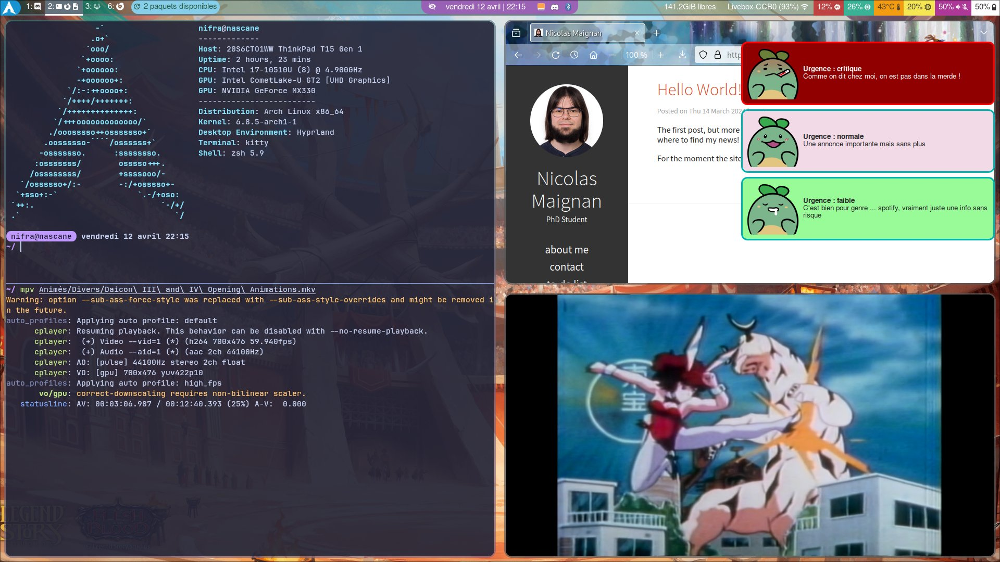

# My dotfiles - Managed with [chezmoi](https://www.chezmoi.io/)

<details>
<summary>Desktop example</summary>



[](https://swordscomic.com)

</details>

## What can you expect

Bad casual english and some french in dotfiles. Bc I'm french, yup.

## What I use on my setup

| Need                | Answer                                                                               | Comments                                                               |
| ------------------- | ------------------------------------------------------------------------------------ | ---------------------------------------------------------------------- |
| Distribution        | [Arch](https://archlinux.org/)                                                       | love it or hate it, I love it                                          |
| Compositor          | [Hyprland](https://hyprland.org/)                                                    | tile manager that hype me                                              |
| Statusbar           | [waybar](https://github.com/Alexays/Waybar)                                          | just perfect                                                           |
| Notification daemon | [dunst](https://dunst-project.org/)                                                  | a little complicated to configure from scratch                         |
| Logout Utility      | [wleave](https://github.com/AMNatty/wleave)                                          | I prefer this fork of [wlogout](https://github.com/ArtsyMacaw/wlogout) |
| Shell               | [zsh](https://www.zsh.org/) (without oh-my-zsh)                                      | better config than bash, more DIY than fish                            |
| File Manager        | CLI : [ranger](https://ranger.fm/) / GUI : [nemo](https://github.com/linuxmint/nemo) | ranger -> vim motion for the win                                       |
| Terminal Emulator   | [kitty](https://sw.kovidgoyal.net/kitty/)                                            | tiling and tabs included, pretty powerfull                             |
| IDE                 | [neovim](https://neovim.io/) with [lazy.vim](https://github.com/folke/lazy.nvim)     | Config is working even if not super clean                              |

## What I accomodate with at work

| Need                | Answer                                               | Comments                             |
| ------------------- | ---------------------------------------------------- | ------------------------------------ |
| Distribution        | Ubuntu 22.04                                         | canonical not the best, apt outdated |
| Desktop Environment | [Regolith](https://regolith-desktop.com/) (i3 as TM) | i dn't want issues with the GPU      |
| File Manager        | the gnome thing                                      | ... it works. Nothing to say         |

## Installation

> [!Important]
> A symlink is needed : `ln -s .config/zsh/.zshenv .zshenv`, once you have cloned the repo.

### Arch Linux :

```BASH
pacman -S chezmoi
chezmoi init --apply https://gitlab.com/nifra/dotfiles.git
```

### Ubuntu :

```BASH
snap install chezmoi --classic
chezmoi init --apply https://gitlab.com/nifra/dotfiles.git
```

<details>
<summary>apt</summary>

```BASH
sudo apt install btop dunst kitty neofetch ranger zsh
```

</details>

<details>
<summary>snap</summary>

```BASH
sudo snap install mpv
sudo snap install node --classic
sudo snap install nvim --classic
```

> [!Important]
> For nvim to work with node.js, it is needed to add the node snap directly in your path : `export PATH=/snap/node/current/bin:$PATH` (see the .zshenv).

</details>

<details>
<summary>Lazygit</summary>

```BASH
LAZYGIT_VERSION=$(curl -s "https://api.github.com/repos/jesseduffield/lazygit/releases/latest" | grep -Po '"tag_name": "v\K[^"]*')
curl -Lo lazygit.tar.gz "https://github.com/jesseduffield/lazygit/releases/latest/download/lazygit_${LAZYGIT_VERSION}_Linux_x86_64.tar.gz"
tar xf lazygit.tar.gz lazygit
sudo install lazygit /usr/local/bin
```

</details>

<details>
<summary>Poetry</summary>

```BASH
curl -sSL https://install.python-poetry.org | python3 -
```

</details>

<details>
<summary>Nerd Fonts</summary>

```BASH
zsh ~/.scripts/nerd_fonts_install.bash
```

</details>

## That's everything folks

Yeah maybe this readme will be updated, but ... yeah ¯\\\_(ツ)\_/¯

À plus dans le bus !

## Acknowledgements

### Icons used : Quest Sprout

[](https://ko-fi.com/s/9f790faf39)

"Quest Sprout" and "Swords: The Webcomic" are © 2018-2024 by Matthew J Wills.
All rights reserved.

"Quest Sprout" is a licensed trademark
