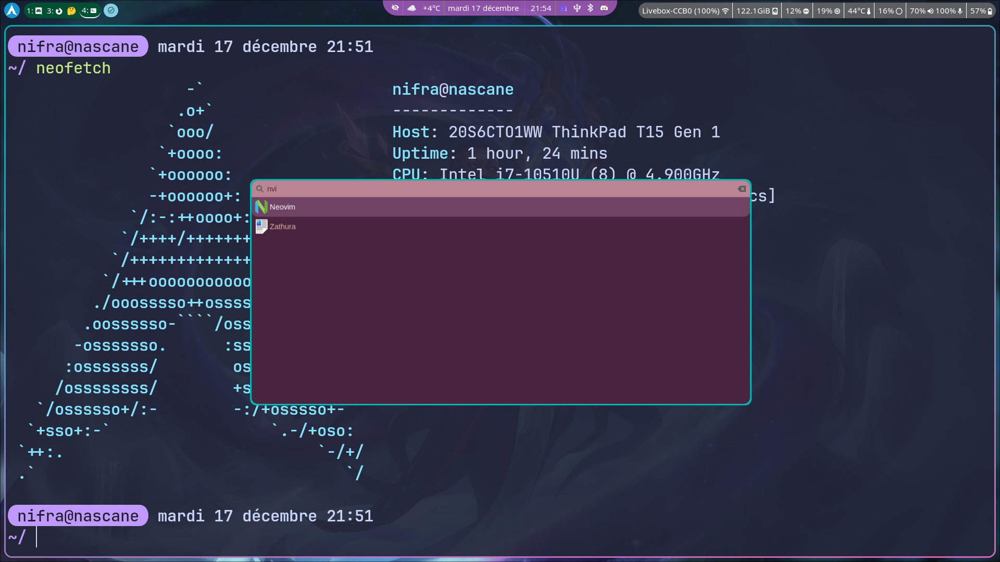
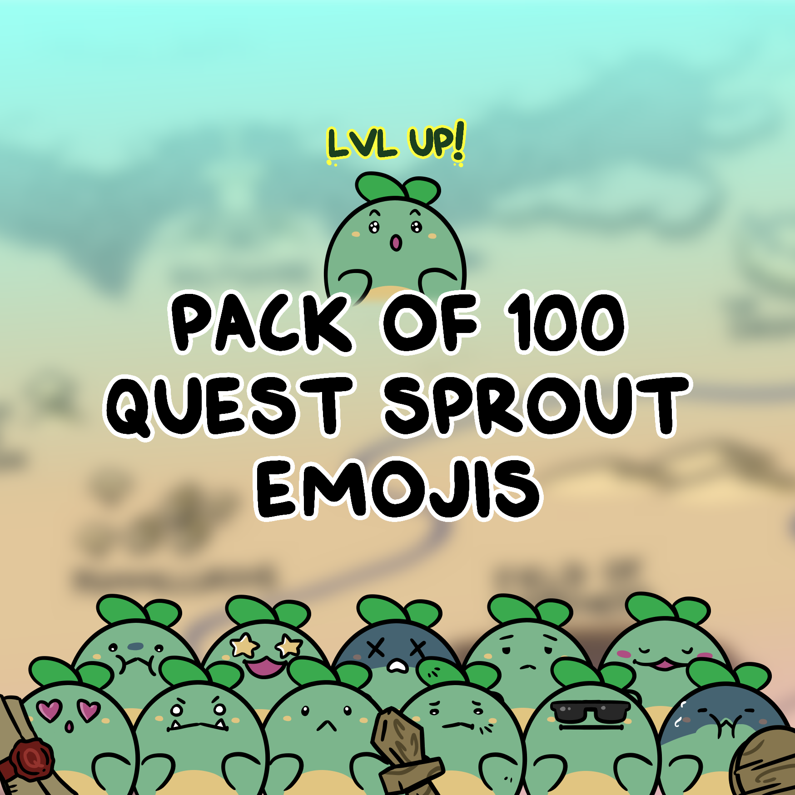

# My dotfiles - Managed with [chezmoi](https://www.chezmoi.io/)

<details>
<summary>Desktop example (terminal theme has changed)</summary>



</details>

## What can you expect

Bad casual english and some french in dotfiles. Bc I'm french, yup.

And my nvim config is [here](https://gitlab.com/nifra/nvim).

## What I use on my setup

| Need                | Answer                                              | Comments                                                               |
| ------------------- | --------------------------------------------------- | ---------------------------------------------------------------------- |
| Distribution        | [Arch](https://archlinux.org/)                      | love it or hate it, I love it                                          |
| Compositor          | [Hyprland](https://hyprland.org/)                   | tile manager that hype me                                              |
| Statusbar           | [waybar](https://github.com/Alexays/Waybar)         | just perfect                                                           |
| Wallpaper daemon    | [awww](https://codeberg.org/LGFae/awww)             | dynamic and beautiful transitions                                      |
| Notification daemon | [dunst](https://dunst-project.org/)                 | a little complicated to configure from scratch                         |
| Logout Utility      | [wleave](https://github.com/AMNatty/wleave)         | I prefer this fork of [wlogout](https://github.com/ArtsyMacaw/wlogout) |
| Shell               | [zsh](https://www.zsh.org/) (without oh-my-zsh)     | better config than bash, more DIY than fish                            |
| CLI File Explorer   | [yazi](https://yazi-rs.github.io/)                  | vim motion for the win                                                 |
| GUI File Explorer   | [nautilus](https://apps.gnome.org/fr/Nautilus/)     | the less ugly for me                                                   |
| Terminal Emulator   | [ghostty](https://ghostty.org/)                     | tiling and tabs included, pretty powerfull                             |
| IDE                 | [neovim](https://neovim.io/)                        | so cool and powerfull and hackable and perfect ...                     |
| Git TUI             | [lazygit](https://github.com/jesseduffield/lazygit) | intuitive and powerfull, with vim motions                              |

## What I accomodate with at work

| Need                | Answer                                               | Comments                             |
| ------------------- | ---------------------------------------------------- | ------------------------------------ |
| Distribution        | Ubuntu 22.04                                         | canonical not the best, apt outdated |
| Desktop Environment | [Regolith](https://regolith-desktop.com/) (i3 as TM) | I don't want issues with the GPU     |

## Installation

### Arch Linux :

```BASH
pacman -S chezmoi
chezmoi init --apply https://gitlab.com/nifra/dotfiles.git
```

The packages will be installed automatically, but for now not everything is automatic (like `paru` install, colors and wallpaper).
Yes I want to full automatize install from bare Arch to my distro.
No I don't plan to do that soon.

### Ubuntu :

```BASH
snap install chezmoi --classic
chezmoi init --apply https://gitlab.com/nifra/dotfiles.git
```

To install all the applications, run the script `~/.scripts/make_ubuntu_usable`.

> ⚠️
> For nvim to work with node.js, you need to add the node snap directly to your path: `export PATH=/snap/node/current/bin:$PATH` (see the `.zshenv`).

## That's everything folks

Yeah, maybe this readme will be updated, but ... yeah ¯\\\_(ツ)\_/¯

À plus dans le bus !

## Acknowledgements

### Icons used : Quest Sprout

<a href="https://ko-fi.com/s/9f790faf39">

</a>

"Quest Sprout" and "Swords: The Webcomic" are © 2018-2024 by Matthew J Wills.
All rights reserved.

"Quest Sprout" is a licensed trademark
